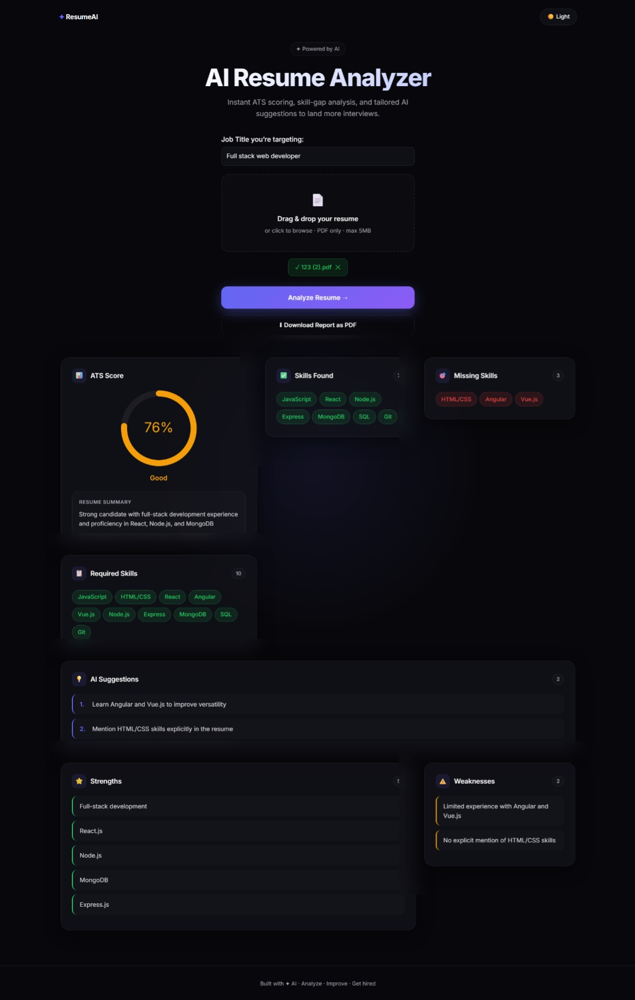

# 🚀 AI Resume Analyzer

An AI-powered Resume Analyzer that evaluates resumes against a target job role and provides ATS-style analysis, skill-gap detection, personalized feedback, and actionable improvement suggestions.

Upload your resume, enter your desired job role, and receive an AI-generated ATS score, required skills, missing skills, strengths, weaknesses, and recommendations to improve your chances of getting shortlisted.

---

## 🌐 Live Demo

**Frontend:**
https://ai-resume-analyzer-v2-one.vercel.app

**Backend API:**
https://ai-resume-analyzer-n2e3.onrender.com

---

## 📸 Preview





---

## ✨ Features

### 📄 Resume Analysis

* PDF Resume Upload
* Resume Parsing using PDF-Parse
* AI-Powered Resume Summary
* Detailed Resume Evaluation

### 🎯 Job Role Based ATS Analysis

* Enter Any Target Job Role
* AI Generates Required Skills for that Role
* Resume Compared Against Role Requirements
* Dynamic ATS Score Calculation
* Skill Gap Analysis

### 📊 Detailed Insights

* ATS Score Visualization
* Skills Found
* Missing Skills
* Required Skills
* Strengths Analysis
* Weakness Analysis
* Personalized AI Suggestions

### 🎨 User Experience

* Modern Glassmorphism UI
* Dark / Light Theme Toggle
* Fully Responsive Design
* Mobile Friendly Layout
* Interactive Dashboard

### 📥 Reports

* Download Analysis Report as PDF

### 🤖 AI Powered

* Groq API Integration
* Llama 3.3 70B Versatile Model

---

## 🎯 How It Works

1. Enter your target job role.

   * Full Stack Developer
   * Frontend Developer
   * Banker
   * Accountant
   * Data Analyst
   * Any Other Role

2. Upload your Resume (PDF).

3. AI generates:

   * Required Skills for the selected role
   * Skills found in the resume
   * Missing skills
   * ATS Score
   * Strengths
   * Weaknesses
   * Improvement Suggestions

4. Download the report.

---

## 🛠️ Tech Stack

### Frontend

* React.js
* Axios
* React Circular Progressbar
* jsPDF
* CSS3
* Responsive Design

### Backend

* Node.js
* Express.js
* Multer
* PDF-Parse
* CORS
* Dotenv

### AI

* Groq API
* Llama 3.3 70B Versatile

---

## 🧠 AI Features

### Role-Based Skill Extraction

AI automatically identifies the most important skills required for any job role.

### Resume Skill Matching

Compares resume content against generated role-specific skills.

### Dynamic ATS Scoring

Calculates ATS score based on skill match percentage and resume quality.

### Skill Gap Analysis

Highlights missing skills that need improvement.

### Personalized Recommendations

Provides AI-generated suggestions to improve employability.

---

## 📂 Project Structure

```text
ai-resume-analyzer-v2
│
├── frontend
│   ├── public
│   ├── src
│   ├── package.json
│   └── vite.config.js
│
├── backend
│   ├── config
│   ├── controllers
│   ├── routes
│   ├── uploads
│   ├── package.json
│   └── server.js
│
└── README.md
```

---

## ⚙️ Installation

### 1. Clone Repository

```bash
git clone https://github.com/krsna-shukla/ai-resume-analyzer-v2.git
```

---

### 2. Backend Setup

```bash
cd backend
npm install
```

Create a `.env` file:

```env
GROQ_API_KEY=YOUR_GROQ_API_KEY
```

Run Backend:

```bash
npm start
```

or

```bash
npm run dev
```

---

### 3. Frontend Setup

```bash
cd frontend
npm install
npm run dev
```

---

## 🚀 Deployment

### Frontend Deployment

* Vercel

### Backend Deployment

* Render

---

## 📊 Example Analysis Output

### ATS Score

```text
78%
```

### Required Skills

```text
React
Node.js
MongoDB
Express.js
REST APIs
Git
JavaScript
```

### Missing Skills

```text
Docker
AWS
CI/CD
```

### Suggestions

```text
Learn Docker fundamentals
Gain experience with AWS
Build cloud-based projects
```

---

## 🚀 Future Improvements

* 📌 Resume vs Job Description Matching
* 🤖 AI Interview Question Generator
* 🎓 Personalized Learning Roadmap
* 📈 ATS Score Breakdown by Category
* 📊 Resume Analytics Dashboard
* 🏢 Company-Specific Resume Analysis
* 📚 Course Recommendations Based on Missing Skills
* 🔗 LinkedIn Profile Analyzer

---

## 👨‍💻 Author

**Krishna Shukla**

GitHub:
https://github.com/krsna-shukla

---

## ⭐ Support

If you found this project useful, consider giving it a ⭐ on GitHub.

---

## 📜 License

This project is licensed under the MIT License.
